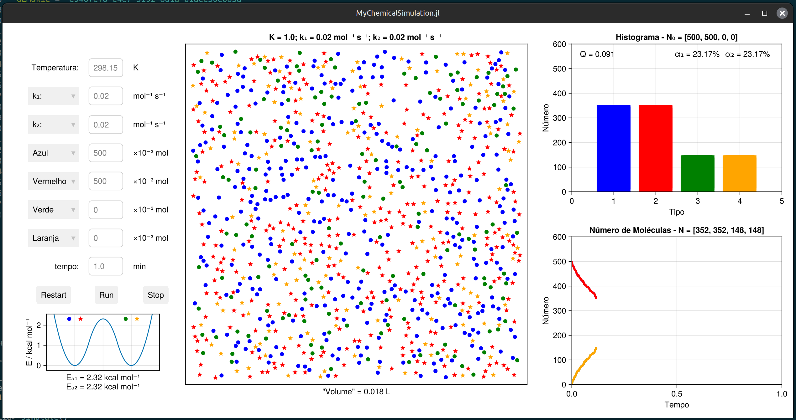

[](https://lmiq.github.io/MyChemicalSimulation.jl/stable)
[](https://lmiq.github.io/MyChemicalSimulation.jl/dev)

# MyChemicalSimulation

Simula uma reação do tipo A + B ⇋ C + D

## Como instalar

Instale a linguagem Julia de https://julialang.org/

Entre no prompt e copie e cole os comandos (isto pode demorar vários minutos,
porque vai instalar todas as dependências):

```julia
julia> import Pkg; Pkg.add(url="https://github.com/lmiq/MyChemicalSimulation.jl")

julia> using MyChemicalSimulation
```

Uma vez terminado todo o processo, você verá outra vez o prompt `julia>`. 

## Como usar

Abra o prompt de Julia e copie e cole:

```julia
julia> using MyChemicalSimulation 

julia> simulate()
```

Isto deve abrir uma janela como esta:



### Como atualizar

Copie este comando:
```julia
julia> import Pkg; Pkg.update("MyChemicalSimulation")

```
